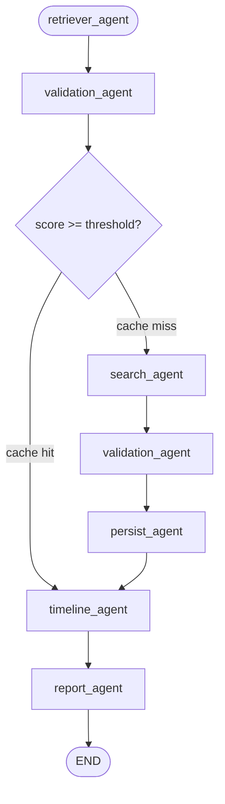

# Technical Specification — ChromaDB Cache Retriever

**Feature**: feat-003
**Status**: Approved
**Date**: 2026-05-07

---

## 1. Executive Summary

Inserção de um node `retriever_agent` como entry point do grafo LangGraph. O node embeda a query com `gemini-embedding-2`, consulta o ChromaDB e popula `raw_results`. O `validation_agent` existente é reaproveitado para scorear esses resultados. Um roteador condicional decide entre usar o cache (score >= threshold) ou acionar a busca web. O `search_agent` existente segue inalterado (exceto pela adição de `web_searched: True` no estado retornado).

---

## 2. Architecture

### Novo Fluxo do Grafo



> **Nota**: `validation_agent` aparece duas vezes no diagrama para clareza, mas é o mesmo node no grafo. O roteador usa o campo `web_searched` do estado para evitar loop infinito.

### Fluxo Anterior (referência)

```
search → validation → persist → timeline → report
```

### Fluxo Novo

```
retriever → validation → [router]
                           ├── cache hit  → timeline → report
                           └── cache miss → search → validation → persist → timeline → report
```

---

## 3. Design Decisions

| Decisão | Escolha | Alternativa Descartada | Motivo |
|---------|---------|------------------------|--------|
| Reutilizar `validation_agent` | Sim | Node `cache_scorer` separado | Evita duplicar lógica de scoring |
| Controle de loop via `web_searched` | Flag no estado | Node `validation_web` separado | Mais simples, sem duplicação de node |
| Escala do threshold | 0–10 (env) → normaliza para 0–100 internamente | Threshold em 0–100 | Escala 0–10 é mais intuitiva para o usuário |
| Cache hit pula persist | Sim | Re-persistir sempre | Dados já estão no banco; duplicação desnecessária |
| N results do ChromaDB | 5 (mesmo do Tavily) | Mais ou menos | Consistência com volume de resultados da web |

---

## 4. Estado — Mudanças em `workflow/state.py`

Adicionar dois campos ao `WorkflowState`:

```python
class WorkflowState(TypedDict):
    # ... campos existentes ...

    # Controle de roteamento cache vs web
    web_searched: bool          # True após search_agent executar
    cache_hit: bool | None      # True = usou cache; False = foi para web; None = não determinado ainda
```

---

## 5. Novo Arquivo — `core/vector_store.py` (adição de método)

Adicionar método `query_results` à classe `VectorStore`:

```python
def query_results(
    self,
    query: str,
    embeddings: GoogleGenerativeAIEmbeddings,
    n_results: int = 5,
    sites: list[str] | None = None,
) -> list[RawResult]:
    """Busca semântica no ChromaDB com filtro opcional de sites."""
    vector = embeddings.embed_query(query)

    where: dict | None = None
    if sites:
        if len(sites) == 1:
            where = {"site": {"$eq": sites[0]}}
        else:
            where = {"$or": [{"site": {"$eq": s}} for s in sites]}

    try:
        results = self._collection.query(
            query_embeddings=[vector],
            n_results=n_results,
            where=where,
            include=["documents", "metadatas"],
        )
    except Exception:
        return []

    docs = results.get("documents", [[]])[0]
    metas = results.get("metadatas", [[]])[0]

    raw: list[RawResult] = []
    for doc, meta in zip(docs, metas):
        stored_query = meta.get("query", "")
        prefix = f"{stored_query}\n"
        content = doc[len(prefix):] if doc.startswith(prefix) else doc
        raw.append(
            RawResult(
                title=meta.get("title", ""),
                url=meta.get("url", ""),
                content=content,
                site=meta.get("site") or None,
                published_date=None,  # não armazenado nos metadados
            )
        )

    return raw
```

---

## 6. Novo Arquivo — `workflow/agents/retriever_agent.py`

```python
import os
from datetime import datetime, timezone

from langchain_google_genai import GoogleGenerativeAIEmbeddings

from core.vector_store import VectorStore
from workflow.state import WorkflowState, TimelineEvent


def retriever_agent(state: WorkflowState) -> dict:
    query = state["query"]
    sites = state.get("sites", [])
    print("[1/N] Retriever Agent     → Consultando ChromaDB...")

    timeline_events: list[TimelineEvent] = []
    timeline_events.append(_event("Retriever Agent", "Início do workflow — consultando ChromaDB", query=query))

    try:
        embeddings = GoogleGenerativeAIEmbeddings(model="gemini-embedding-2")
        store = VectorStore(db_path="./db/")
        raw_results = store.query_results(
            query=query,
            embeddings=embeddings,
            n_results=5,
            sites=sites if sites else None,
        )
    except Exception as exc:
        timeline_events.append(
            _event("Retriever Agent", f"Erro ao consultar ChromaDB: {exc}", query=query)
        )
        return {
            "raw_results": [],
            "web_searched": False,
            "cache_hit": None,
            "timeline": timeline_events,
            "workflow_start": datetime.now(timezone.utc).isoformat(),
        }

    count = len(raw_results)
    filter_info = f" (filtro: {', '.join(sites)})" if sites else ""
    timeline_events.append(
        _event(
            "Retriever Agent",
            f"Consulta ao ChromaDB concluída{filter_info}",
            query=query,
            details=f"{count} resultado(s) encontrado(s)",
        )
    )

    return {
        "raw_results": raw_results,
        "web_searched": False,
        "cache_hit": None,
        "timeline": timeline_events,
        "workflow_start": datetime.now(timezone.utc).isoformat(),
    }


def _event(agent: str, action: str, site: str | None = None,
           query: str | None = None, details: str | None = None) -> TimelineEvent:
    return TimelineEvent(
        timestamp=datetime.now(timezone.utc).isoformat(),
        agent=agent, action=action, site=site, query=query, details=details,
    )
```

---

## 7. Modificação — `workflow/agents/search_agent.py`

Adicionar ao dict retornado pelo `search_agent`:

```python
return {
    "raw_results": raw_results,
    "web_searched": True,          # NOVO — sinaliza que busca web foi executada
    "timeline": timeline_events,
    "workflow_start": state.get("workflow_start") or datetime.now(timezone.utc).isoformat(),
}
```

Também adicionar evento de timeline indicando cache miss:

```python
# Adicionar ANTES do loop de busca por sites ou busca geral:
timeline_events.append(
    _event("Search Agent", "Cache insuficiente — busca na web acionada", query=query)
)
```

---

## 8. Modificação — `workflow/graph.py`

```python
import os
from langgraph.graph import StateGraph, END

from workflow.state import WorkflowState
from workflow.agents.retriever_agent import retriever_agent
from workflow.agents.search_agent import search_agent
from workflow.agents.validation_agent import validation_agent
from workflow.agents.timeline_agent import timeline_agent
from workflow.agents.report_agent import report_agent
from workflow.agents.persist_agent import persist_agent


def _route_after_validation(state: WorkflowState) -> str:
    """
    - Se já veio da web (web_searched=True): vai para persist.
    - Se ChromaDB retornou 0 resultados: vai direto para web.
    - Se melhor score >= threshold: cache hit → pula web e persist.
    - Senão: cache miss → busca na web.
    """
    if state.get("web_searched", False):
        return "persist"

    ranked = state.get("ranked_results", [])
    if not ranked:
        return "search"

    try:
        threshold = float(os.environ.get("RETRIEVAL_SCORE_THRESHOLD", "7"))
    except (ValueError, TypeError):
        threshold = 7.0

    best_score_normalized = ranked[0]["score"] / 10  # 0-100 → 0-10
    return "timeline" if best_score_normalized >= threshold else "search"


def build_graph() -> StateGraph:
    graph = StateGraph(WorkflowState)

    graph.add_node("retriever", retriever_agent)
    graph.add_node("search", search_agent)
    graph.add_node("validation", validation_agent)
    graph.add_node("timeline", timeline_agent)
    graph.add_node("report", report_agent)
    graph.add_node("persist", persist_agent)

    graph.set_entry_point("retriever")
    graph.add_edge("retriever", "validation")
    graph.add_conditional_edges(
        "validation",
        _route_after_validation,
        {
            "timeline": "timeline",   # cache hit
            "search": "search",       # cache miss (primeira vez)
            "persist": "persist",     # após busca web (web_searched=True)
        },
    )
    graph.add_edge("search", "validation")
    graph.add_edge("persist", "timeline")
    graph.add_edge("timeline", "report")
    graph.add_edge("report", END)

    return graph.compile()
```

---

## 9. Modificação — `.env`

Adicionar variável:

```dotenv
# Score mínimo (escala 0-10) para aceitar resultados do ChromaDB sem busca na web.
# Abaixo deste valor, o workflow realiza busca na web normalmente.
# Default: 7
RETRIEVAL_SCORE_THRESHOLD=7
```

---

## 10. Modificação — `workflow/state.py`

```python
class WorkflowState(TypedDict):
    # Input
    query: str
    sites: list[str]
    sites_group: str | None

    # Agent outputs
    raw_results: list[RawResult]
    ranked_results: list[RankedResult]
    timeline: Annotated[list[TimelineEvent], operator.add]
    html_path: str | None

    # Cache control (NOVOS)
    web_searched: bool
    cache_hit: bool | None

    # Runtime
    errors: Annotated[list[str], operator.add]
    workflow_start: str | None
    persisted_count: int
```

---

## 11. Atualização do `main.py`

Adicionar `web_searched` e `cache_hit` ao estado inicial:

```python
initial_state = {
    "query": query,
    "sites": sites,
    "sites_group": sites_group,
    "raw_results": [],
    "ranked_results": [],
    "timeline": [],
    "html_path": None,
    "web_searched": False,      # NOVO
    "cache_hit": None,          # NOVO
    "errors": [],
    "workflow_start": None,
}
```

---

## 12. Timeline Events — Resumo

| Agent | Evento | Condição |
|-------|--------|----------|
| Retriever Agent | "Início do workflow — consultando ChromaDB" | Sempre |
| Retriever Agent | "Consulta ao ChromaDB concluída (filtro: X)" + N resultados | Sempre |
| Retriever Agent | "Erro ao consultar ChromaDB: ..." | Em caso de exceção |
| Validation Agent | "Início do ranking de N resultado(s)" | Existente |
| Validation Agent | "Ranking concluído — N resultado(s) ordenados por score" | Existente |
| Search Agent | "Cache insuficiente — busca na web acionada" | Apenas em cache miss |
| Search Agent | Eventos de busca por site / geral | Existentes |

---

## 13. Testing Strategy

### Testes Unitários (críticos)

| Teste | Arquivo | O que valida |
|-------|---------|--------------|
| `test_query_results_no_filter` | `tests/test_vector_store.py` | Retorna RawResult sem filtro de site |
| `test_query_results_site_filter` | `tests/test_vector_store.py` | Aplica filtro `where` para site único |
| `test_query_results_multi_site_filter` | `tests/test_vector_store.py` | Aplica filtro `$or` para múltiplos sites |
| `test_query_results_empty_collection` | `tests/test_vector_store.py` | Retorna lista vazia sem erros |
| `test_route_cache_hit` | `tests/test_graph_router.py` | score >= 7 → rota "timeline" |
| `test_route_cache_miss` | `tests/test_graph_router.py` | score < 7 → rota "search" |
| `test_route_web_searched` | `tests/test_graph_router.py` | web_searched=True → rota "persist" |
| `test_route_empty_results` | `tests/test_graph_router.py` | ranked=[] → rota "search" |
| `test_threshold_default` | `tests/test_graph_router.py` | Sem env var → usa 7.0 |

---

## 14. Files Changed

| Arquivo | Tipo | Mudança |
|---------|------|---------|
| `workflow/agents/retriever_agent.py` | NOVO | Node retriever completo |
| `core/vector_store.py` | MODIFICADO | Adiciona `query_results()` |
| `workflow/graph.py` | MODIFICADO | Novo fluxo com retriever + roteamento condicional |
| `workflow/state.py` | MODIFICADO | Adiciona `web_searched`, `cache_hit` |
| `workflow/agents/search_agent.py` | MODIFICADO | Retorna `web_searched=True`, adiciona evento timeline |
| `main.py` | MODIFICADO | Adiciona campos novos ao `initial_state` |
| `.env` | MODIFICADO | Adiciona `RETRIEVAL_SCORE_THRESHOLD=7` |
